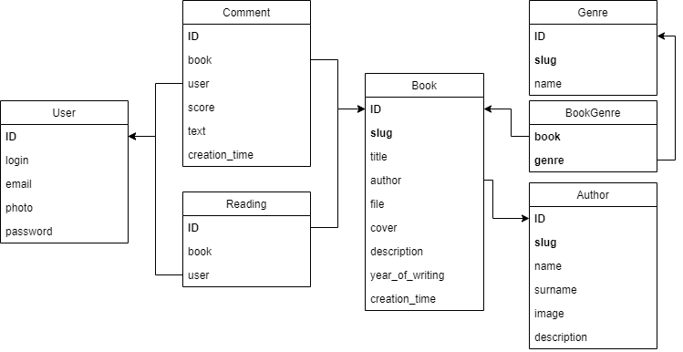
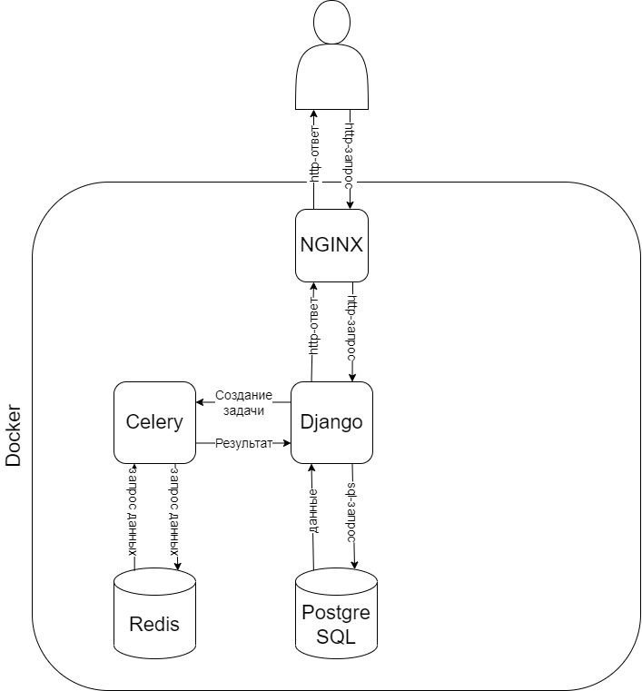

# Онлайн-библиотека

## Развертывание приложения

Для того, чтобы развернуть приложение вам понадобится Docker.

### Настройка переменных окружения

Предварительно необходимо настроить переменные окружения. Для этого создайте в папке проекта файл .env с
соответствующими настройками (пример такого файла - .env.example) или __скопируйте__ файл .env.example и переименуйте его в
.env.

### Запуск приложения

Для того чтобы запустить приложение, в папке проекта выполните команду:

#### `docker-compose up -d`

После этого API приложения станет доступно по адресу [http://127.0.0.1/api/]()

Административная панель Django станет доступна по адресу [http://127.0.0.1/admin/]()

Документация swagger по адресу [http://127.0.0.1/api/swagger/]()

### Остановка приложения

Чтобы остановить приложение, выполните команду:

#### `docker-compose down`

## Инициализация данных

### Создание суперпользователя

Для полноценной работы с приложением вам понадобится создать суперпользователя, который будет обладать всеми правами,
для этого выполните:

#### `docker exec -it online-library-django python manage.py createsuperuser` 

## Внутренняя логика

### Модель базы данных

### Архитектура приложения

